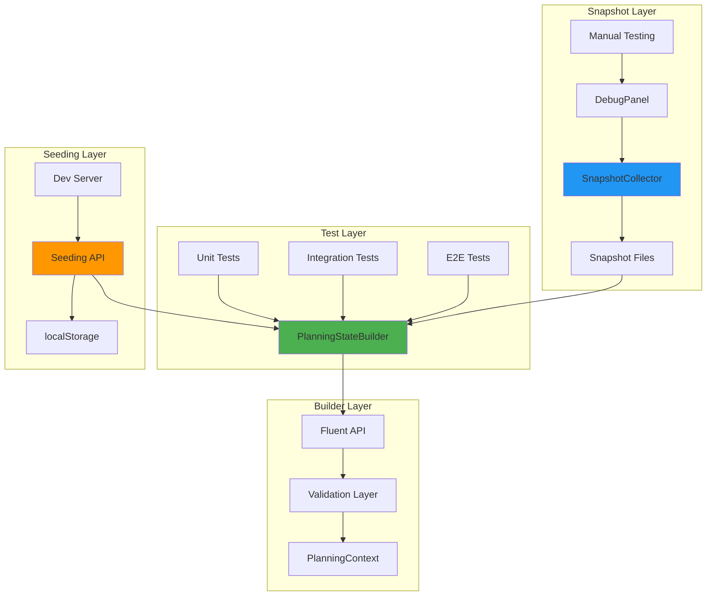
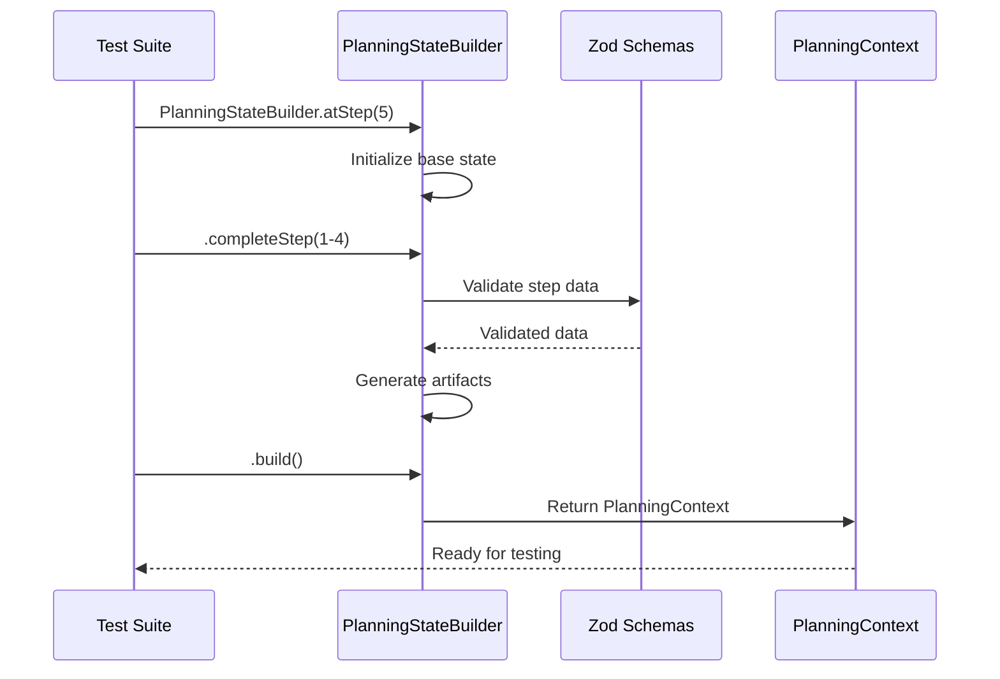
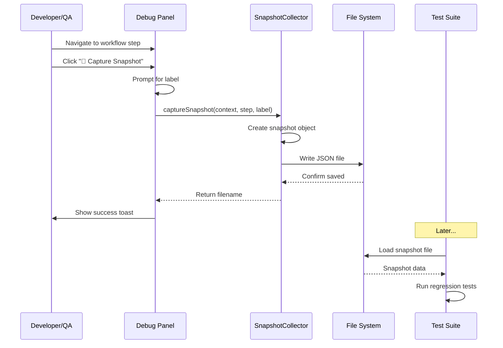

# Testing Framework Guide

**Version:** 1.0  
**Last Updated:** 2026-05-14  
**Purpose:** Comprehensive guide to the Planning Workflow testing infrastructure

---

## Table of Contents

1. [Overview](#overview)
2. [Architecture](#architecture)
3. [Quick Start](#quick-start)
4. [PlanningStateBuilder API](#planningstatebuilder-api)
5. [Snapshot System](#snapshot-system)
6. [Test Helper Functions](#test-helper-functions)
7. [Seeding API](#seeding-api)
8. [NPM Scripts Reference](#npm-scripts-reference)
9. [Best Practices](#best-practices)
10. [Troubleshooting](#troubleshooting)
11. [Advanced Patterns](#advanced-patterns)

---

## Overview

### What is this framework?

The Planning Workflow Testing Framework is an enterprise-grade testing infrastructure that enables:

- **Fast test execution**: Skip to any workflow step instantly (10x faster)
- **Improved coverage**: Test edge cases at later steps without completing earlier steps
- **Regression prevention**: Capture and replay real workflow states
- **Manual QA efficiency**: Pre-seed test data for development and QA workflows

### Core Components

```
tests/fixtures/
├── builders/
│   └── PlanningStateBuilder.ts       # Fluent API for building test states
├── snapshots/
│   ├── SnapshotCollector.ts          # Capture real workflow states
│   ├── *.json                         # Captured snapshot files
│   ├── INDEX.md                       # Snapshot catalog
│   └── CAPTURE-LOG.md                 # Capture history
├── validation/
│   ├── schemas.ts                     # Zod validation schemas
│   └── validators.ts                  # Helper validation functions
└── config.ts                          # Test environment configuration
```

---

## Architecture

### System Overview



### Data Flow



### Snapshot Capture Flow



---

## Quick Start

### 1. Basic Test with Builder

```typescript
import { describe, expect, it } from 'vitest';
import { PlanningStateBuilder } from './fixtures/builders/PlanningStateBuilder';

describe('My Feature', () => {
  it('tests Step 5 behavior', () => {
    // Create state at Step 5 with Steps 1-4 completed
    const state = PlanningStateBuilder.atStep(5)
      .completeStep(1)
      .completeStep(2)
      .completeStep(3)
      .completeStep(4)
      .build();
    
    // State is ready to test
    expect(state.currentStepNumber).toBe(5);
    expect(state.completedSteps).toEqual([1, 2, 3, 4]);
    expect(state.artifacts[1]).toBeDefined(); // Gap analysis
  });
});
```

### 2. Custom Data Test

```typescript
it('tests with custom business requirements', () => {
  const state = PlanningStateBuilder.atStep(3)
    .withProjectId('healthcare-app')
    .withBusinessRequirements([
      {
        question: 'What is the primary goal?',
        value: 'HIPAA-compliant patient portal',
        timestamp: '2026-05-14T10:00:00.000Z'
      }
    ])
    .build();
  
  expect(state.step2Answers).toHaveLength(1);
  expect(state.artifacts[2]).toBeDefined(); // Business reqs artifact
});
```

### 3. Snapshot-Based Test

```typescript
import { promises as fs } from 'fs';

it('reproduces production edge case', async () => {
  // Load captured snapshot
  const snapshotPath = 'tests/fixtures/snapshots/step-5-missing-critical-*.json';
  const files = await fs.readdir('tests/fixtures/snapshots');
  const file = files.find(f => f.match(/step-5-missing-critical-\d+\.json/));
  
  const snapshot = JSON.parse(
    await fs.readFile(`tests/fixtures/snapshots/${file}`, 'utf-8')
  );
  
  const context = snapshot.xstateSnapshot.context;
  
  // Test the edge case
  expect(context.step5Responses).toBeDefined();
  // ... your assertions
});
```

---

## PlanningStateBuilder API

### Factory Methods

#### `PlanningStateBuilder.new()`

Creates a new builder for Step 1 with minimal defaults.

```typescript
const builder = PlanningStateBuilder.new();
const state = builder.build();

// Returns:
// {
//   projectId: 'test-project',
//   entryPath: 'new-project',
//   currentStepNumber: 1,
//   completedSteps: [],
//   step1Responses: {},
//   step2Answers: [],
//   step3Answers: [],
//   step5Responses: {},
//   step7Edits: null,
//   artifacts: {},
//   error: null,
//   startedAt: '<ISO timestamp>',
//   updatedAt: '<ISO timestamp>'
// }
```

#### `PlanningStateBuilder.atStep(stepNumber: number)`

Creates a builder positioned at a specific step with `completedSteps` automatically set.

```typescript
// Create state at Step 5 (Steps 1-4 marked complete)
const builder = PlanningStateBuilder.atStep(5);

// completedSteps = [1, 2, 3, 4]
// currentStepNumber = 5
```

**Use this when:** Testing a specific step without caring about exact data from previous steps.

---

### Fluent API Methods

All methods return `this` for method chaining.

#### Project Configuration

```typescript
// Set project ID
.withProjectId(id: string): this

// Set entry path
.withEntryPath(entryPath: 'new-project' | 'existing-project'): this

// Examples:
PlanningStateBuilder.new()
  .withProjectId('mobile-app-2026')
  .withEntryPath('existing-project')
  .build();
```

#### Step Data Methods

```typescript
// Step 1: Gap Analysis
.withStep1Responses(responses: Record<string, string>): this
.withGapAnalysis(responses: ValidatedStep1Responses): this

// Step 2: Business Requirements Interview
.withStep2Answers(answers: InterviewAnswer[]): this
.withStep2CurrentQuestion(question: string | null, options: string[] | null): this
.withBusinessRequirements(answers: ValidatedInterviewAnswer[]): this

// Step 3: Technical Requirements Interview
.withStep3Answers(answers: InterviewAnswer[]): this
.withStep3CurrentQuestion(question: string | null, options: string[] | null): this
.withTechnicalRequirements(answers: ValidatedInterviewAnswer[]): this

// Step 5: Implementation Planning
.withStep5Responses(responses: Record<string, string>): this

// Step 7: User Edits
.withStep7Edits(edits: string | null): this
```

#### State Management

```typescript
// Set current step number
.withCurrentStepNumber(stepNumber: number): this

// Set completed steps array
.withCompletedSteps(steps: number[]): this

// Set error state
.withError(error: string | null): this

// Add/override artifact
.withArtifact(stepNumber: number, artifact: Artifact): this
```

#### Step Completion

```typescript
// Complete a step with default data + generate artifact
.completeStep(stepNumber: number): this

// Example: Complete Steps 1-3
PlanningStateBuilder.atStep(4)
  .completeStep(1)
  .completeStep(2)
  .completeStep(3)
  .build();
```

**What `completeStep()` does:**
- Populates step-specific data with sensible defaults
- Generates the appropriate artifact for that step
- **Does NOT** modify `completedSteps` or `currentStepNumber` (you control that)

#### Build Method

```typescript
// Finalize and return PlanningContext
.build(): PlanningContext

// Throws error if state is invalid
```

---

### Complete API Example

```typescript
const state = PlanningStateBuilder.atStep(7)
  .withProjectId('enterprise-crm')
  .withEntryPath('new-project')
  .completeStep(1)
  .completeStep(2)
  .completeStep(3)
  .completeStep(4)
  .completeStep(5)
  .completeStep(6)
  .withStep7Edits('User requested: Add OAuth integration')
  .withError(null)
  .build();

// State is now ready for testing Step 7 behavior
```

---

## Snapshot System

### Overview

Snapshots capture **real workflow states** during manual testing for use in regression tests. Each snapshot contains:

- Full XState snapshot (status, value, context)
- Metadata (version, timestamp, step number, label)
- Complete `PlanningContext` with all artifacts and data

### Snapshot File Structure

```json
{
  "version": "1.0",
  "capturedAt": "2026-05-14T10:30:45.123Z",
  "stepNumber": 5,
  "label": "minimal-responses",
  "xstateSnapshot": {
    "status": "active",
    "value": "step5",
    "context": { /* Full PlanningContext */ },
    "children": {},
    "historyValue": {},
    "tags": []
  }
}
```

### Capturing Snapshots

#### Method 1: Manual Capture via Debug Panel (Recommended)

1. Start dev server: `npm run dev`
2. Navigate to the target workflow step in the UI
3. Open the Debug Panel (visible in development mode)
4. Click **"📸 Capture Snapshot"** button
5. Enter a descriptive label (e.g., `missing-critical`, `happy-path`)
6. Snapshot is saved to `tests/fixtures/snapshots/`

**Filename format:** `step-{N}-{label}-{timestamp}.json`

#### Method 2: Programmatic Capture (For Automation)

```typescript
import { SnapshotCollector } from './fixtures/snapshots/SnapshotCollector';
import { PlanningStateBuilder } from './fixtures/builders/PlanningStateBuilder';

const collector = new SnapshotCollector();

// Build edge case state
const state = PlanningStateBuilder.atStep(5)
  .completeStep(1)
  .completeStep(2)
  .completeStep(3)
  .completeStep(4)
  .withStep5Responses({ approach: 'minimal' })
  .build();

// Capture snapshot
const filename = await collector.captureSnapshot(
  state,
  5,
  'minimal-responses'
);

console.log(`Snapshot saved: ${filename}`);
```

See: `scripts/generate-edge-case-snapshots.ts` for a complete example.

### Loading Snapshots in Tests

```typescript
import { promises as fs } from 'fs';
import { join } from 'path';

async function loadSnapshot(pattern: string) {
  const dir = join(process.cwd(), 'tests/fixtures/snapshots');
  const files = await fs.readdir(dir);
  
  const file = files.find(f => f.includes(pattern));
  if (!file) throw new Error(`Snapshot not found: ${pattern}`);
  
  const content = await fs.readFile(join(dir, file), 'utf-8');
  return JSON.parse(content);
}

// Usage in tests
it('handles edge case from snapshot', async () => {
  const snapshot = await loadSnapshot('step-5-minimal-responses');
  const context = snapshot.xstateSnapshot.context;
  
  // Test with real captured state
  expect(context.step5Responses.approach).toBe('minimal');
});
```

### Snapshot Management

```bash
# Validate all snapshots (JSON integrity, required fields, etc.)
npm run snapshots:validate

# List snapshots grouped by step/label
npm run snapshots:list

# Show statistics and coverage
npm run snapshots:stats

# Clean up duplicate snapshots
npm run snapshots:validate -- --clean
```

### Snapshot Documentation

- **`snapshots/INDEX.md`**: Catalog of all snapshots with descriptions and usage
- **`snapshots/CAPTURE-LOG.md`**: Chronological log of capture sessions

---

## Test Helper Functions

### Validation Helpers

Located in `tests/fixtures/validation/`

```typescript
import {
  validatePlanningContext,
  validateInterviewAnswer,
  validateArtifact,
  assertValidPlanningContext
} from './fixtures/validation';

// Validate with detailed error messages
const result = validatePlanningContext(state);
if (!result.success) {
  console.error('Validation errors:', result.errors);
}

// Assert valid (throws on failure)
assertValidPlanningContext(state); // Throws if invalid

// Validate individual fields
validateInterviewAnswer(answer);
validateArtifact(artifact);
```

### Snapshot Helpers

```typescript
// Find latest snapshot matching pattern
function findLatestSnapshot(snapshots: Snapshot[], pattern: string): Snapshot | undefined {
  return snapshots
    .filter(s => s.label.includes(pattern))
    .sort((a, b) => b.capturedAt.localeCompare(a.capturedAt))[0];
}

// Group snapshots by step and label
function groupSnapshotsByStepAndLabel(snapshots: Snapshot[]) {
  return snapshots.reduce((acc, snapshot) => {
    const key = `step${snapshot.stepNumber}-${snapshot.label}`;
    if (!acc[key]) acc[key] = [];
    acc[key].push(snapshot);
    return acc;
  }, {} as Record<string, Snapshot[]>);
}
```

---

## Seeding API

**⚠️ Development Only**: Seeding endpoints are disabled in production via middleware.

### Environment Configuration

```typescript
// tests/fixtures/config.ts
export const TEST_ENV = {
  ENABLE_SEEDING: process.env.NODE_ENV === 'development',
  ENABLE_SNAPSHOT_CAPTURE: process.env.NODE_ENV === 'development'
};
```

### Seeding Endpoint (Not Yet Implemented)

**Planned API:**

```http
POST /api/dev/seed
Content-Type: application/json

{
  "projectId": "test-project-123",
  "stepNumber": 5,
  "label": "standard"
}

Response:
{
  "success": true,
  "projectId": "test-project-123",
  "storageKey": "planning-machine-test-project-123"
}
```

**Usage:** Seed localStorage for manual testing without completing Steps 1-4.

---

## NPM Scripts Reference

### Testing Scripts

```bash
# Run all tests
npm test

# Run tests in watch mode
npm run test:watch

# Run tests with coverage
npm run test:coverage

# Run specific test file
npm test snapshots/snapshot-edge-cases
```

### Snapshot Scripts

```bash
# Generate automated standard snapshots (Steps 1-10)
npm run snapshots:generate

# Generate edge case snapshots programmatically
npm run snapshots:generate-edge-cases

# Validate all snapshots
npm run snapshots:validate

# List all snapshots
npm run snapshots:list

# Show statistics
npm run snapshots:stats
```

### Development Scripts

```bash
# Start dev server (enables Debug Panel + seeding)
npm run dev

# Build for production
npm run build

# Run linter
npm run lint
```

---

## Best Practices

### 1. Choose the Right Abstraction Level

```typescript
// ✅ GOOD: Use atStep() for simple step positioning
const state = PlanningStateBuilder.atStep(5)
  .completeStep(1)
  .completeStep(2)
  .completeStep(3)
  .completeStep(4)
  .build();

// ❌ BAD: Manually setting everything when atStep() would work
const state = PlanningStateBuilder.new()
  .withCurrentStepNumber(5)
  .withCompletedSteps([1, 2, 3, 4])
  .withStep1Responses({ /* ... */ })
  .withStep2Answers([ /* ... */ ])
  // ... tedious manual setup
  .build();
```

### 2. Use Validation in Tests

```typescript
// ✅ GOOD: Validate state before testing
it('validates state structure', () => {
  const state = PlanningStateBuilder.atStep(3)
    .completeStep(1)
    .completeStep(2)
    .build();
  
  assertValidPlanningContext(state); // Ensures integrity
  
  // Now test your feature
  expect(state.artifacts[2]).toBeDefined();
});
```

### 3. Test Edge Cases with Snapshots

```typescript
// ✅ GOOD: Capture real edge cases for regression tests
it('handles incomplete interview data', async () => {
  const snapshot = await loadSnapshot('step-2-incomplete-3q');
  const context = snapshot.xstateSnapshot.context;
  
  // Test with real production-like data
  expect(context.step2Answers).toHaveLength(3);
});

// ❌ BAD: Manually constructing complex edge cases
it('handles incomplete interview data', () => {
  const state = PlanningStateBuilder.new()
    .withStep2Answers([
      { question: 'Q1', value: 'A1', timestamp: '...' },
      { question: 'Q2', value: 'A2', timestamp: '...' },
      // ... many lines of manual setup
    ])
    .build();
});
```

### 4. Keep Tests Focused

```typescript
// ✅ GOOD: Test one thing per test
it('generates artifact when Step 2 completes', () => {
  const state = PlanningStateBuilder.atStep(3)
    .completeStep(1)
    .completeStep(2)
    .build();
  
  expect(state.artifacts[2]).toBeDefined();
  expect(state.artifacts[2].type).toBe('yaml');
});

it('includes business requirements in artifact', () => {
  const state = PlanningStateBuilder.atStep(3)
    .completeStep(1)
    .completeStep(2)
    .build();
  
  expect(state.artifacts[2].content).toContain('Business Requirements');
});

// ❌ BAD: Testing multiple things in one test
it('completes Step 2 correctly', () => {
  const state = PlanningStateBuilder.atStep(3)
    .completeStep(1)
    .completeStep(2)
    .build();
  
  expect(state.artifacts[2]).toBeDefined();
  expect(state.artifacts[2].type).toBe('yaml');
  expect(state.step2Answers).toHaveLength(3);
  expect(state.completedSteps).toContain(2);
  // Too many assertions - hard to debug failures
});
```

### 5. Document Custom Snapshots

When capturing snapshots, add entries to `snapshots/INDEX.md`:

```markdown
### step-5-minimal-responses-*.json

**Step:** 5 (Implementation Planning)  
**Purpose:** Tests system behavior when user provides minimal responses  
**Captured:** 2026-05-14  

**Usage:**
\`\`\`typescript
const snapshot = await loadSnapshot('step-5-minimal-responses');
expect(snapshot.context.step5Responses).toBeDefined();
\`\`\`
```

---

## Troubleshooting

### Issue: `completeStep()` doesn't update `completedSteps`

**Cause:** `completeStep()` only populates step data. You must manually update `completedSteps`.

**Solution:**

```typescript
// ✅ CORRECT
const state = PlanningStateBuilder.atStep(3)
  .completeStep(1)
  .completeStep(2)
  .withCompletedSteps([1, 2]) // Must set explicitly
  .build();

// OR use atStep() which handles it:
const state = PlanningStateBuilder.atStep(3) // Sets completedSteps = [1, 2]
  .completeStep(1)
  .completeStep(2)
  .build();
```

### Issue: Snapshot file not found in tests

**Cause:** Snapshot filename includes timestamp, making exact paths hard to match.

**Solution:** Use glob patterns or helper functions:

```typescript
// ✅ GOOD: Use helper to find latest
const snapshot = findLatestSnapshot(allSnapshots, 'missing-critical');

// ✅ GOOD: List files and match pattern
const files = await fs.readdir('tests/fixtures/snapshots');
const file = files.find(f => f.includes('step-5-minimal'));
```

### Issue: Validation errors from builder

**Cause:** Zod schemas enforce strict validation. Check error message.

**Solution:**

```typescript
// ❌ FAILS: Invalid timestamp format
.withStep2Answers([
  { question: 'Q1', value: 'A1', timestamp: 'not-a-timestamp' }
])

// ✅ PASSES: Valid ISO 8601 timestamp
.withStep2Answers([
  { question: 'Q1', value: 'A1', timestamp: '2026-05-14T10:00:00.000Z' }
])
```

### Issue: `localStorage is not available` error

**Cause:** Trying to capture from `localStorage` in Node.js environment.

**Solution:** Use programmatic capture with state objects:

```typescript
// ❌ FAILS in Node: localStorage doesn't exist
await collector.captureSnapshot('project-123', 5, 'label');

// ✅ WORKS: Pass state object directly
const state = PlanningStateBuilder.atStep(5).build();
await collector.captureSnapshot(state, 5, 'label');
```

### Issue: Tests fail after updating PlanningContext type

**Cause:** Builder may be out of sync with latest type definition.

**Solution:**

1. Update `PlanningStateBuilder.ts` to include new fields
2. Update default values in `.new()` factory method
3. Run `npm test` to find remaining issues

### Issue: Snapshot validation warnings

**Cause:** Snapshot may use old version or have filename sanitization differences.

**Solution:**

```bash
# Check snapshot integrity
npm run snapshots:validate

# View detailed stats
npm run snapshots:stats

# If snapshot is truly broken, delete and recapture
rm tests/fixtures/snapshots/step-5-old-*.json
```

---

## Advanced Patterns

### Pattern 1: Testing State Transitions

```typescript
describe('State transitions', () => {
  it('transitions from Step 2 to Step 3', () => {
    // State before transition
    const beforeStep3 = PlanningStateBuilder.atStep(2)
      .completeStep(1)
      .withStep2CurrentQuestion('What is the timeline?', ['3mo', '6mo'])
      .build();
    
    expect(beforeStep3.currentStepNumber).toBe(2);
    expect(beforeStep3.step2CurrentQuestion).toBeTruthy();
    
    // State after transition
    const afterStep3 = PlanningStateBuilder.atStep(3)
      .completeStep(1)
      .completeStep(2)
      .withStep2CurrentQuestion(null, null)
      .build();
    
    expect(afterStep3.currentStepNumber).toBe(3);
    expect(afterStep3.step2CurrentQuestion).toBeNull();
    expect(afterStep3.completedSteps).toContain(2);
  });
});
```

### Pattern 2: Parameterized Tests

```typescript
describe.each([
  { step: 1, expectedArtifacts: 0 },
  { step: 2, expectedArtifacts: 1 },
  { step: 3, expectedArtifacts: 2 },
  { step: 5, expectedArtifacts: 4 }
])('Step $step artifacts', ({ step, expectedArtifacts }) => {
  it(`generates ${expectedArtifacts} artifacts`, () => {
    const builder = PlanningStateBuilder.atStep(step);
    for (let i = 1; i < step; i++) {
      builder.completeStep(i);
    }
    const state = builder.build();
    
    expect(Object.keys(state.artifacts)).toHaveLength(expectedArtifacts);
  });
});
```

### Pattern 3: Custom Builders for Domain Tests

```typescript
// tests/features/business-requirements/fixtures.ts
export class BusinessRequirementsBuilder {
  static withHealthcareContext() {
    return PlanningStateBuilder.atStep(2)
      .withProjectId('healthcare-portal')
      .completeStep(1)
      .withBusinessRequirements([
        {
          question: 'What is the primary goal?',
          value: 'HIPAA-compliant patient portal',
          timestamp: '2026-05-14T10:00:00.000Z'
        },
        {
          question: 'Who are the users?',
          value: 'Patients, doctors, administrators',
          timestamp: '2026-05-14T10:01:00.000Z'
        }
      ]);
  }
  
  static withMinimalData() {
    return PlanningStateBuilder.atStep(2)
      .completeStep(1)
      .withBusinessRequirements([]);
  }
}

// Usage in tests
it('handles healthcare requirements', () => {
  const state = BusinessRequirementsBuilder.withHealthcareContext().build();
  expect(state.step2Answers[0].value).toContain('HIPAA');
});
```

### Pattern 4: Snapshot Comparison Tests

```typescript
it('matches baseline snapshot structure', async () => {
  const baseline = await loadSnapshot('step-5-standard');
  const current = PlanningStateBuilder.atStep(5)
    .completeStep(1)
    .completeStep(2)
    .completeStep(3)
    .completeStep(4)
    .build();
  
  // Compare structure (not exact values)
  expect(Object.keys(current)).toEqual(Object.keys(baseline.xstateSnapshot.context));
  expect(Object.keys(current.artifacts)).toEqual(
    Object.keys(baseline.xstateSnapshot.context.artifacts)
  );
});
```

---

## Related Documentation

- **Implementation Plan**: `.tmp-docs/implementation-plan-testing-framework.md`
- **Snapshot Catalog**: `tests/fixtures/snapshots/INDEX.md`
- **Capture Log**: `tests/fixtures/snapshots/CAPTURE-LOG.md`
- **Validation Schemas**: `tests/fixtures/validation/schemas.ts`

---

## Contributing

### Adding New Builder Methods

1. Add method to `PlanningStateBuilder` class
2. Add validation if needed
3. Update this guide with examples
4. Add tests in `tests/fixtures/builders/PlanningStateBuilder.test.ts`

### Capturing New Snapshots

1. Follow manual capture process (see [Capturing Snapshots](#capturing-snapshots))
2. Add entry to `snapshots/INDEX.md`
3. Log capture in `snapshots/CAPTURE-LOG.md`
4. Run `npm run snapshots:validate` to verify

### Reporting Issues

- Check [Troubleshooting](#troubleshooting) first
- Include error message and code snippet
- Mention which builder methods or snapshots are involved

---

**Last Updated:** 2026-05-14  
**Maintainer:** Planning Workflow Team  
**Questions?** See implementation plan or ask in team chat.
